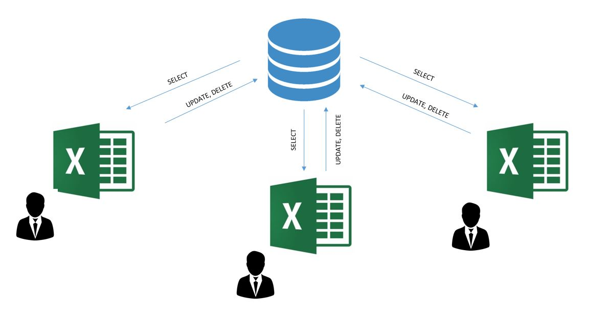

<h2>Excel User Interface for Quering SQLite Database</h2>
<h3>Intro</h3>

Using Excel and restrictive programmed in VBA logic in order to let users to interact with SQL database.

With that solution we can protect the database and prevents users from sending undesirable queries.

<h3>Conclusions</h3>
<ul>
  <li>Excel VBA and SQLite integraion requires SQLite3 ODBC Driver installation and adding it in the system ODBC administartion panel.</li>
  <li>VBA code dictates what queries user can send to database.</li>
  <li>Excel connecting SQLite is bulit in the way user doesn't have to know any SQL queris</li>
<ul>
