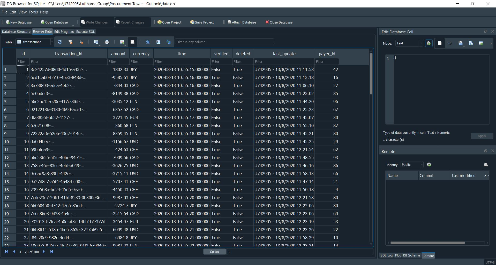

<h2>Excel User Interface for Quering SQLite Database</h2>

<h3>Intro</h3>

Using Excel and restrictive programmed in VBA logic in order to let users to interact with SQL database.

With that solution we can protect the database and prevents users from sending undesirable queries.

<h3>Demo</h3>

Data processing in Excel:

Changes are reflected in database live:

<h3>Toolset</h3>
<ul>
  <li>Excel VBA and SQLite integraion requires SQLite3 ODBC Driver installation and adding it in the system ODBC administartion panel.</li>
  <ul>
    <li>Download sqliteodbc.exe from http://www.ch-werner.de/sqliteodbc/,</li>
    <li>Start installation on your computer,</li>
    <li>Run ODBC administartion panel,</li>
    <li>In User DSN tab add new User Data Source,</li>
    <li>Give it a name and browse for db file,</li>
    <li>Accept by clicking OKs.</li>
  </ul>
  <li>Anoter useful piece of software is DB Browser for SQLite which allows us to view data schemas and data tables themsleves as well as to query db (printscreen above).</li>
</ul>

<h3>Conclusions</h3>
<ul>
  <li>VBA code dictates what queries user can send to database.</li>
  <li>Excel connecting SQLite is bulit in the way user doesn't have to know any SQL queries.</li>
  <li>User can simply retrieve, update and delete data with Excel interface instead.</li>
<ul>
